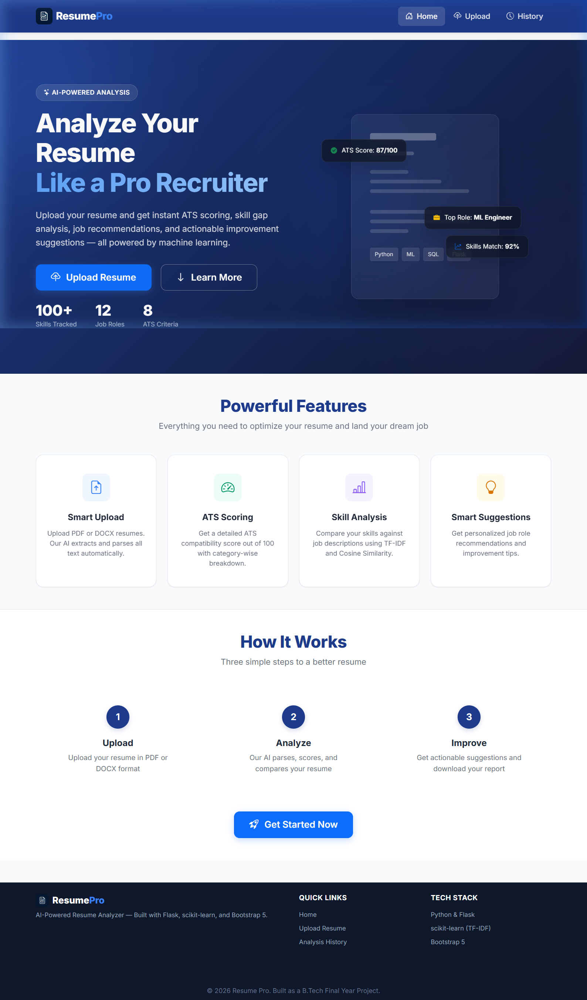
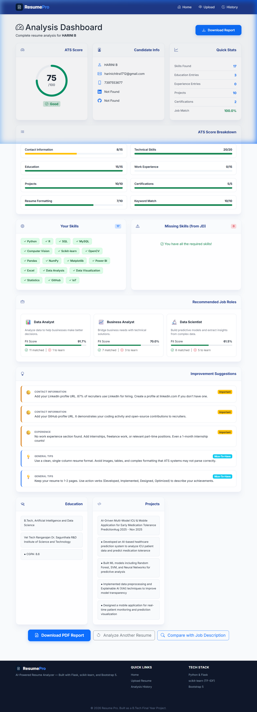

# Resume Pro – AI-Powered Resume Analyzer

A professional, full-stack **Resume Pro** application built with **Python**, **Flask**, **SQLite**, and **scikit-learn** (TF-IDF + Cosine Similarity). This application validates and uploads resumes (PDF/DOCX), extracts and parses key information (Name, Email, Skills, Projects, Experience, etc.), scores them based on Applicant Tracking System (ATS) criteria, compares skills against job descriptions using machine learning, recommends suitable career paths/courses, and generates downloadable PDF summaries.

---

## 🎨 Application Screenshots & Live Output

### 1. Landing Page (`http://127.0.0.1:5000/`)


### 2. Analysis Dashboard (`http://127.0.0.1:5000/dashboard/<id>`)


### 3. Smart Upload Interface (`http://127.0.0.1:5000/upload`)


---

## 🚀 Key Features

* **Dual-Format Upload Support**: Handles both `.pdf` and `.docx` formats securely.
* **Smart Text Extraction & Section Parsing**: Extracts raw text using `pdfplumber` and `python-docx` and maps it using regular expression heuristics into structured data.
* **Predefined Skills Database**: Integrates a robust list of 100+ technical/soft skills categorized by domains (AI/ML, Cloud/DevOps, Databases, etc.).
* **Job Description Comparator**: Pastes any target job description and parses its required skill sets to identify matched and missing keywords.
* **ML-Based Similarity Matching**: Utilizes Scikit-learn's `TfidfVectorizer` and Cosine Similarity to compute a semantic matching percentage between the resume and the job specification.
* **100-Point ATS Score Calculator**: Scores profiles across 8 components including contact info, projects, education, certs, formatting, and keyword matching.
* **Actionable Improvement Recommendations**: Flags critical, important, and nice-to-have adjustments.
* **Upskilling & Job Recommendations**: Maps user capabilities to job roles and suggests learning paths with links/platforms for missing competencies.
* **Interactive Dashboard**: Responsive web layout styled with a premium blue-white professional color theme, featuring animated progress rings, progress bars, and tabbed previews.
* **PDF Report Generator**: Compiles all analysis details into a downloadable PDF document on the fly using `fpdf2`.
* **Historical Tracking**: Stores previous uploads and scores in an SQLite database, allowing candidates to view past profiles or download reports later.

---

## 📁 Project Folder Structure

```
resume-analyzer/
├── app.py                    # Main Flask application server (routes & error handlers)
├── config.py                 # Central configurations (secret keys, upload paths, limits)
├── requirements.txt          # Python dependencies list
├── .gitignore                # Version control ignore definitions
├── README.md                 # Project documentation
├── database/
│   ├── __init__.py           # Package indicator
│   ├── db.py                 # SQLite setup, schema initialization, and CRUD operations
│   └── resume_analyzer.db    # SQLite database file (auto-created)
├── models/
│   ├── __init__.py           # Package indicator
│   └── resume.py             # Data schema models and template dictionary definitions
├── static/
│   ├── css/
│   │   └── style.css         # Styling stylesheet (blue-white layout & animations)
│   ├── img/                  # Application logos and screenshot previews
│   │   ├── logo.png
│   │   ├── landing_preview.png
│   │   ├── dashboard_preview.png
│   │   └── upload_preview.png
│   ├── js/
│   │   └── main.js           # Interactive JS elements (drag-drop uploads & count-up score rings)
│   └── reports/              # Storage for dynamic PDF reports
├── templates/
│   ├── base.html             # Global base template (common navbar & footers)
│   ├── index.html            # Landing / home screen
│   ├── upload.html           # File upload screen
│   ├── extracted.html        # Raw extracted text review page
│   ├── analyze.html          # Job description comparison paste page
│   ├── dashboard.html        # Full analysis metrics dashboard
│   ├── history.html          # Historical uploads table
│   └── error.html            # Graceful custom error pages (404, 500, etc.)
└── uploads/                  # Temporary file storage directory for resumes
```

---

## 🛠️ Installation & Local Setup

### Prerequisites
Make sure you have **Python 3.8+** installed on your system:
```bash
python --version
```

### Steps

1. **Clone the Repository**:
   ```bash
   git clone https://github.com/harini-buildon/Resume-pro.git
   cd Resume-pro
   ```

2. **Create a Virtual Environment**:
   ```bash
   # Windows
   python -m venv venv
   venv\Scripts\activate

   # macOS / Linux
   python3 -m venv venv
   source venv/bin/activate
   ```

3. **Install Dependencies**:
   ```bash
   pip install -r requirements.txt
   ```

4. **Launch the Flask Server**:
   ```bash
   python app.py
   ```
   *The server will initialize the database schema and host the application at `http://127.0.0.1:5000/`.*

5. **Open in Browser**:
   Navigate to [http://127.0.0.1:5000/](http://127.0.0.1:5000/) to use Resume Pro.

---

## 🗃️ Database Schema

The SQLite schema initializes two tables:

### 1. `resumes` table
```sql
CREATE TABLE resumes (
    id INTEGER PRIMARY KEY AUTOINCREMENT,
    filename TEXT NOT NULL,
    filepath TEXT NOT NULL,
    raw_text TEXT,
    parsed_data TEXT,          -- JSON string storing Name, Email, GitHub, Skills list, etc.
    upload_date TIMESTAMP DEFAULT CURRENT_TIMESTAMP
);
```

### 2. `analyses` table
```sql
CREATE TABLE analyses (
    id INTEGER PRIMARY KEY AUTOINCREMENT,
    resume_id INTEGER NOT NULL,
    ats_score REAL,
    score_breakdown TEXT,      -- JSON string mapping individual section scores
    matched_skills TEXT,       -- JSON string listing matched skill strings
    missing_skills TEXT,       -- JSON string listing missing skill strings
    match_percentage REAL,     -- Percent match against a JD
    suggestions TEXT,          -- JSON string mapping prioritized tips
    job_recommendations TEXT,  -- JSON string of recommended target positions
    course_recommendations TEXT, -- JSON string mapping recommended study materials
    job_description TEXT,      -- Pasted Job description text
    analysis_date TIMESTAMP DEFAULT CURRENT_TIMESTAMP,
    FOREIGN KEY (resume_id) REFERENCES resumes(id)
);
```
