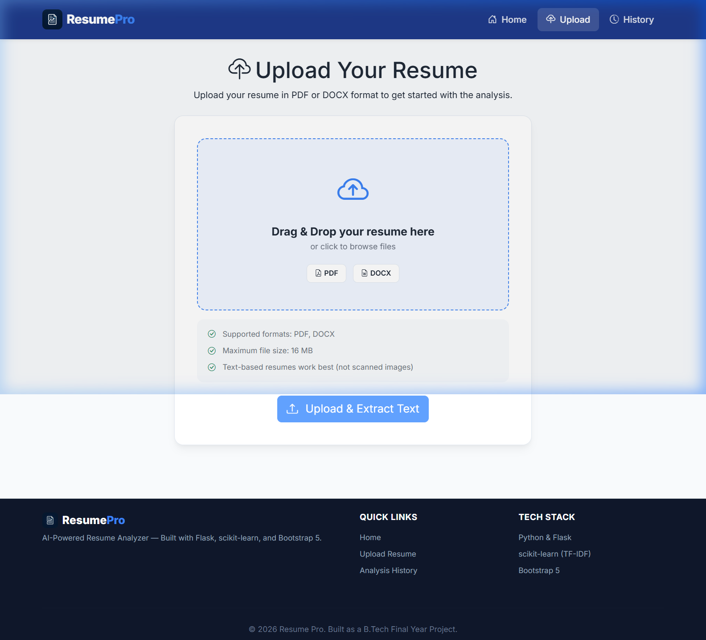

# 🚀 Pro Resume Analyzer – AI-Powered ATS & Career Platform

[](https://python.org)
[](https://flask.palletsprojects.com)
[](https://spacy.io)
[](http://127.0.0.1:5000)
[](LICENSE)

An enterprise-grade, AI-driven career optimization platform built with **Python**, **Flask**, **spaCy NLP**, **Scikit-learn**, **SQLite**, **PostgreSQL**, **Redis**, and a clean responsive UI.

---

## 🌐 Application Access

| Server | URL / Access | Status |
|---|---|---|
| 💻 **Local Host Server** | **[http://127.0.0.1:5000](http://127.0.0.1:5000)** | **Active (Gunicorn / Flask)** |

### 🛡️ Key Features & Protections Active
- **Interactive Dashboard**: Score breakdown cards, category statistics, and ATS score gauge.
- **Hybrid ATS Matching**: 50% Resume Structure + 50% Job Description Skill Overlap & TF-IDF Similarity.
- **PDF Report Generator**: FPDF2 margin resets & safe layout calculations.
- **Security**: `.env` credential isolation, `.gitignore`, MIME magic-bytes upload validation, SSRF URL protection.
- **Production Infrastructure**: Gunicorn WSGI multi-worker config (`Procfile`), Redis rate-limit support, DB connection pooling.

---

## 📸 Screenshots

### 🏠 Landing Page
> Modern dark-themed hero section with feature highlights and step-by-step workflow.


---

### 📤 Upload Resume
> Drag-and-drop upload interface supporting PDF & DOCX formats.



---

### 📊 Analysis Dashboard
> Comprehensive ATS score breakdown, skills analysis, role recommendations, and improvement suggestions.


---

## 🌟 Key Features

1. **Smart Resume Parser**:
   - Extracts contact info (Email, Phone), skills, and structured text from PDF and DOCX files.
   - Powered by regex patterns and spaCy NLP entity recognition.

2. **ATS Compatibility Scoring**:
   - Evaluates key ATS criteria: Contact Info, Skills, Experience, Education, Length, Formatting, File Format, and Action Verbs.
   - Calculates a weighted total ATS score out of 100.

3. **Job Description Comparison (TF-IDF)**:
   - Uses Scikit-learn's `TfidfVectorizer` and `cosine_similarity` to compare resume text against any job posting.
   - Highlights matched skills and missing critical skills.

4. **Role & Career Recommendations**:
   - Recommends matching job roles based on extracted skill profiles.
   - Provides company recommendations and relevant learning project suggestions.

5. **AI Cover Letter & Bullet Enhancer**:
   - Generates customized cover letters for candidate profiles.
   - Enhances resume bullet points with quantitative impact metrics.

---

## 📁 Repository Structure

```
resume-analyzer/
├── app.py                    # Flask server, routing, rate limiting & error handlers
├── config.py                 # Configuration settings (SECRET_KEY, storage folders)
├── Procfile                  # Production Gunicorn WSGI startup configuration
├── database/
│   └── db.py                 # SQLite & PostgreSQL ConnectionPool implementation
├── models/
│   └── resume.py             # Data schemas and structures
├── static/
│   ├── css/
│   │   └── style.css         # Core CSS tokens & global styles
│   ├── js/
│   │   └── main.js           # Base JavaScript interactive logic
│   └── reports/              # Local PDF report storage directory
├── templates/
│   ├── base.html             # Common layout template with dark mode support
│   ├── index.html            # Landing page
│   ├── upload.html           # Drag-and-drop file upload page
│   ├── extracted.html        # Extracted text review & skills preview
│   ├── analyze.html          # Job description comparison page
│   ├── dashboard.html        # ATS analysis dashboard
│   ├── cover_letter.html     # AI Cover letter view & 1-click clipboard copy
│   └── history.html          # Analysis history timeline & PDF report downloads
├── utils/
│   ├── ats_analyzer.py       # ATS scoring algorithm (8 criteria)
│   ├── jd_comparator.py      # TF-IDF & Cosine Similarity match engine
│   ├── text_extractor.py     # PDF (pdfplumber) & DOCX text extraction
│   ├── report_generator.py   # PDF report generator using FPDF2
│   ├── llm_client.py         # Google Gemini AI integration wrapper
│   └── file_handler.py       # File size & MIME magic-bytes validator
├── tests/                    # Automated pytest suite (37 tests)
└── requirements.txt          # Production dependencies
```

---

## ⚙️ Installation & Local Setup

1. **Clone the repository**:
   ```bash
   git clone https://github.com/harini-buildon/Resume-pro.git
   cd Resume-pro
   ```

2. **Set up Virtual Environment**:
   ```bash
   python -m venv venv
   source venv/bin/activate  # On Windows: .\venv\Scripts\activate
   ```

3. **Install Dependencies**:
   ```bash
   pip install -r requirements.txt
   ```

4. **Configure Environment Variables**:
   Create a `.env` file in the root directory:
   ```ini
   SECRET_KEY=your-secure-secret-key
   GEMINI_API_KEY=your-gemini-api-key
   ```

5. **Run Application**:
   ```bash
   python app.py
   ```

6. **Access Application**:
   Open browser at **[http://127.0.0.1:5000](http://127.0.0.1:5000)**

---

## 🧪 Unit Test Suite

Run the automated test suite:

```bash
python -m pytest tests/ -v
```

---

## 📄 License
© 2026 Pro Resume Analyzer. All Rights Reserved. Released under the MIT License.
